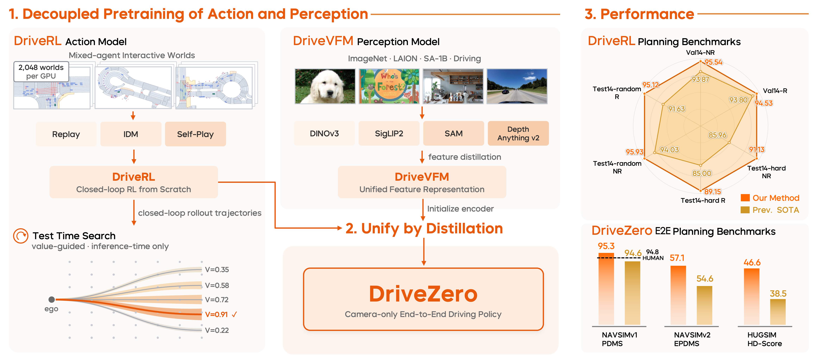

<div align="center">
  
  <hr>
  <p style=" text-align:center; line-height:1.5;">
    <a href="https://arxiv.org/pdf/2609.06055">📄 Tech Report</a>
    &nbsp;|
    <a href="https://xiaomiautol3.github.io/DriveZero/"> 📰 Project Page</a>
  </p>
  <h1 >End-to-End Driving Beyond Human Demonstrations</h1>
</div>

<div align="center">
  
</div>

## 📢 News
- **`2026/9/15`** [DriveRL](./DriveRL/README.md) inference code and checkpoints are released.
- **`2026/9/9`** Our [tech report](https://arxiv.org/pdf/2609.06055) are released on arXiv.

## 📋 TODO List

- [ ] DriveZero.
- [ ] DriveVFM.
- [x] DriveRL inference code and checkpoints.

## Getting Started

- [🚗 DriveRL Inference](./DriveRL/README.md)
## Citation

```bibtex
@article{xiaomi2026drivezero,
  title={DriveZero: End-to-End Driving beyond Human Demonstrations},
  author={Xiaomi L3 Team},
  journal={arXiv preprint arXiv:2609.06055},
  year={2026}
}
```

## Acknowledgements
- [DrivoR](https://github.com/valeoai/DrivoR/) | [SimScale](https://github.com/OpenDriveLab/SimScale) | [NAVSIM](https://github.com/autonomousvision/navsim) | [HUGSIM](https://github.com/hyzhou404/HUGSIM) | [CaRL](https://github.com/autonomousvision/CaRL) | [PlanTF](https://github.com/jchengai/planTF) | [NuPlan](https://github.com/motional/nuplan-devkit)
- [RADIO](https://github.com/nvlabs/radio) | [SAM](https://github.com/facebookresearch/segment-anything) | [DINOv3](https://github.com/facebookresearch/dinov3) | [SigLIP2](https://github.com/google-research/big_vision) | [Depth Anything](https://github.com/LiheYoung/Depth-Anything)
